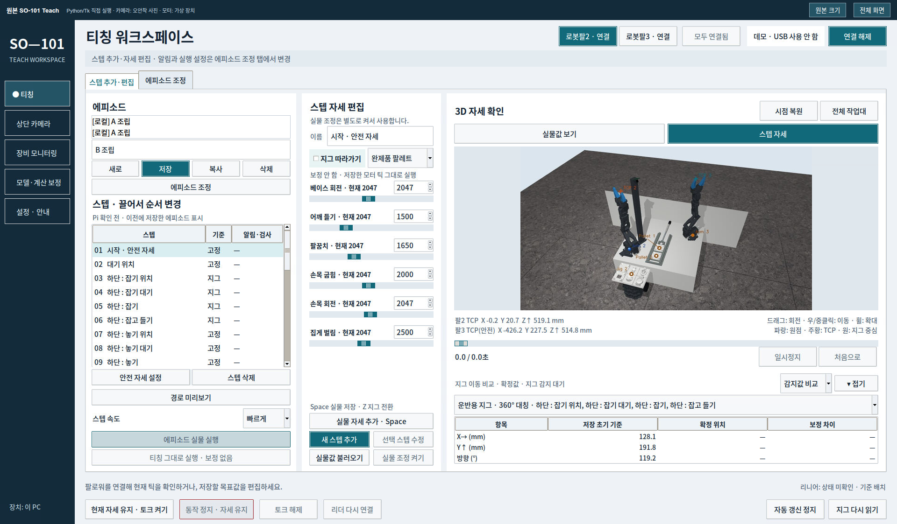

# OpenCV Teach · SO-101 조립대 티칭

카메라로 지그의 위치·방향을 찾고, 저장된 티칭 기준과의 차이를 반영해 로봇팔의 집기·놓기 목표를 보정하는 프로그램입니다. 조립대의 로봇팔2·3과 리니어를 연결하는 PC 티칭 GUI와 Pi 실행 코드를 담았습니다.

**[웹 데모 열기](https://7s-fa.github.io/opencv-teach/)** · [이전 SO-101 작업](https://github.com/7s-FA/so101-workbench)



## 핵심 흐름

1. 자세와 지그 기준을 함께 저장합니다.
2. 실행 전에 카메라로 현재 지그 위치·방향을 다시 읽습니다.
3. 저장한 지그 상대 위치를 현재 기준으로 옮겨 목표 자세를 계산합니다.
4. Pi에서 작업 스텝을 실행합니다. 부품·조립 검사는 필요한 단계에서 추가로 사용합니다.

## 구성

| 경로 | 내용 |
|---|---|
| `SO101_teach/` | 데스크톱 티칭 GUI, 지그 검출·보정, Pi 실행·ROS 2 연동 |
| `SO101_teach/examples/data/` | 오프라인 예제 설정·보정·에피소드·지그 모델 |
| `native-demo/` | 원본 Python/Tk 앱의 브라우저 화면 전송 |
| `third-party-licenses/` | 사용한 외부 모델·코드의 라이선스 원문 |

실사용 주소·USB 식별자와 인증 정보는 공개 설정에서 제외했습니다. 기록된 보정값과 에피소드는 개발 당시 장비의 예제이며 다른 팔에 그대로 적용하는 실행 설정이 아닙니다.

## 데스크톱 오프라인 실행

Python 3.12와 Tk가 있는 Linux 환경을 기준으로 합니다. Ubuntu에서는 `python3-tk`가 필요합니다.

```bash
python3 -m venv .venv
source .venv/bin/activate
pip install -r SO101_teach/requirements-desktop.txt
python SO101_teach/tools/init_demo.py
bash SO101_teach/run.sh --check
bash SO101_teach/run.sh --demo
```

예제 초기화는 `data/`가 이미 있으면 중단하고 기존 설정을 보존합니다. 실제 장치 연결·보정·Pi 배포는 [프로그램 설명](SO101_teach/README.md), [지그 보정](SO101_teach/JIG_FOLLOWING.md), [Pi 준비](SO101_teach/PI_SETUP.md), [통합 실행](SO101_teach/INTEGRATION.md)을 확인하세요. 로컬 환경 경로는 자신의 설치 위치로 설정해야 합니다.

## 원본 GUI를 브라우저에서 실행

[](https://codespaces.new/7s-FA/opencv-teach?quickstart=1)

GitHub 로그인 후 2코어 Codespace를 만들면 환경 설치 후 원본 Python/Tk 앱이 자동 실행됩니다. Ports의 **6080 / SO-101 Teach 원본 앱**을 열면 조작할 수 있습니다. 이 PC의 전원과 무관하며 방문자 자신의 Codespace에서 실행됩니다.

`native-demo/`는 화면 전송과 사진 입력 어댑터만 담당합니다. GUI·3D·검출·검사·티칭 계산은 `SO101_teach/so101_teach` 코드를 직접 실행합니다. 상단 카메라는 오안착 사진을 반복 입력하며 결과를 미리 만들어 보내지 않습니다. 모터는 원본 앱의 `DemoSession`을 사용합니다. 실행마다 복사된 데이터로 시작하며 실사용 설정은 수정하지 않습니다.

첫 설치에는 몇 분이 걸립니다. GitHub 개인 무료 한도는 시간과 저장공간에 제한이 있으므로 [공식 과금 기준](https://docs.github.com/en/billing/concepts/product-billing/github-codespaces)을 확인하고, 사용 후 Codespace를 중지하거나 삭제하세요. 자동 포트는 기본 비공개로 유지합니다. 이전 JavaScript 재구현 데모는 제거했습니다.

## 검증과 로컬 실행

```bash
bash native-demo/setup.sh       # Ubuntu 개발 환경: 시스템 패키지 설치 포함
bash native-demo/start.sh
# 다른 터미널에서
.native-venv/bin/python native-demo/check.py
```

로컬 주소는 `http://127.0.0.1:6080`입니다. 자세한 구성은 [원본 데모 안내](native-demo/README.md)에 있습니다. GitHub Actions에서 실제 Tk 앱의 시작·3D 렌더링·가상 장치 모드를 검사합니다.

화면 기준은 [DESIGN.md](SO101_teach/DESIGN.md)입니다. 외부 모델은 원래 라이선스를 따릅니다. 프로젝트 전체에 별도의 재배포 라이선스를 새로 부여하지 않았습니다.
