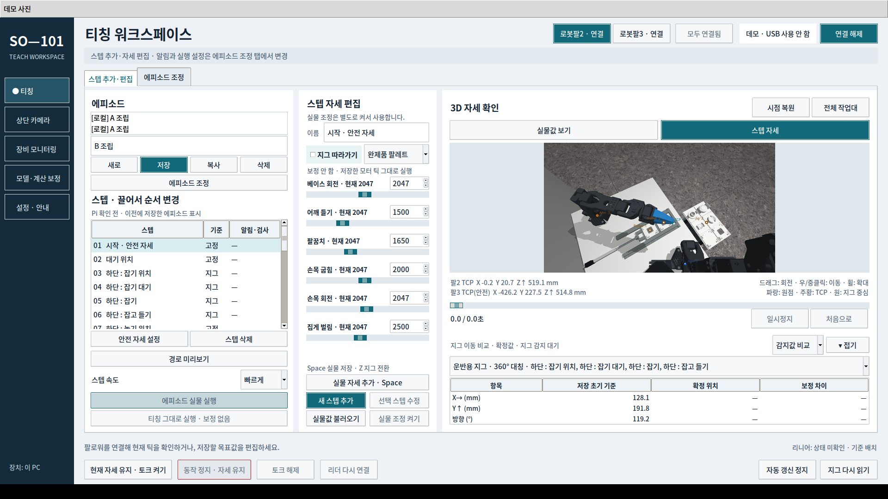

# OpenCV Teach · SO-101 조립대 티칭

카메라로 지그의 위치·방향을 찾고, 저장된 티칭 기준과의 차이를 반영해 로봇팔의 집기·놓기 목표를 보정하는 프로그램입니다. 조립대의 로봇팔2·3과 리니어를 연결하는 PC 티칭 GUI와 Pi 실행 코드를 담았습니다.

**[Windows·Linux 데모 다운로드](https://github.com/7s-FA/opencv-teach/releases/latest)** · [이전 SO-101 작업](https://github.com/7s-FA/so101-workbench)

## 다운로드해서 실행

[최신 릴리스](https://github.com/7s-FA/opencv-teach/releases/latest)의 운영체제에 맞는 파일을 받으세요. GitHub 로그인이나 Python 설치 없이 실행할 수 있습니다.

| 운영체제 | 다운로드 | 실행 |
|---|---|---|
| Windows 10/11 · x64 | `SO101-Teach-Demo-Windows-x64.zip` | 전체 압축 해제 → `SO101-Teach-Demo.exe` |
| Ubuntu 22.04/24.04 · x64 | `SO101-Teach-Demo-Linux-x64.tar.gz` | 전체 압축 해제 → `SO101-Teach-Demo` |

원본 GUI의 3D 작업대·로봇팔, 티칭 편집·저장, OpenCV 검출을 실행합니다. 기본 카메라 입력은 **두 지그가 모두 검출되는 저장 사진**입니다. **데모 사진** 메뉴에서 조립 완료·오안착 사진을 선택할 수 있습니다. 모터는 가상 장치이며 실제 USB·카메라·Pi·네트워크 연결은 차단합니다. 편집 내용은 PC의 별도 데모 폴더에 유지됩니다.

웹 데모와 Codespaces 실행은 사용하지 않습니다. 운영체제 요구사항·데이터 위치·실행 오류 안내는 [다운로드 데모 설명](desktop-demo/README.md)을 확인하세요.



[두 지그를 검출한 카메라 화면](docs/desktop-camera.png)

## 핵심 흐름

1. 자세와 지그 기준을 함께 저장합니다.
2. 실행 전에 카메라로 현재 지그 위치·방향을 다시 읽습니다.
3. 저장한 지그 상대 위치를 현재 기준으로 옮겨 목표 자세를 계산합니다.
4. Pi에서 작업 스텝을 실행합니다. 부품·조립 검사는 필요한 단계에서 추가로 사용합니다.

## 구성

| 경로 | 내용 |
|---|---|
| `SO101_teach/` | 원본 PC 티칭 GUI, Pi 실행 코드, 모델, 테스트, 예제 데이터 |
| `desktop-demo/` | 다운로드 데모 입력 어댑터, 패키징, 실행 검증 |
| `third-party-licenses/` | 포함된 외부 모델·코드의 라이선스 |

예제 보정값과 에피소드는 개발 당시 장비의 예제이며 다른 팔에 그대로 적용하는 실행 설정이 아닙니다.

## 소스로 실행·개발

Linux에서 Python 3.12와 Tk가 필요합니다. Ubuntu에서는 `python3-tk`를 설치합니다.

```bash
python3 -m venv .venv
source .venv/bin/activate
pip install -r desktop-demo/requirements-build.txt
python desktop-demo/app.py
```

실제 장치 연결·보정·Pi 배포는 [프로그램 설명](SO101_teach/README.md), [지그 보정](SO101_teach/JIG_FOLLOWING.md), [Pi 준비](SO101_teach/PI_SETUP.md), [통합 실행](SO101_teach/INTEGRATION.md)을 확인하세요. 원본 실행용 예제 초기화는 `python SO101_teach/tools/init_demo.py`로 수행하며, 기존 `data/`가 있으면 보존합니다.

GitHub Actions에서 Windows와 Ubuntu의 독립 실행 파일을 각각 빌드하고 원본 Tk 화면, 양쪽 로봇팔 3D, 두 지그 검출, 사진 변경, 저장 유지, 실제 연결 차단을 검사합니다. 화면 기준은 [DESIGN.md](SO101_teach/DESIGN.md)입니다. 외부 모델은 원래 라이선스를 따르며 프로젝트 전체에 새로운 재배포 라이선스를 부여하지 않았습니다.
